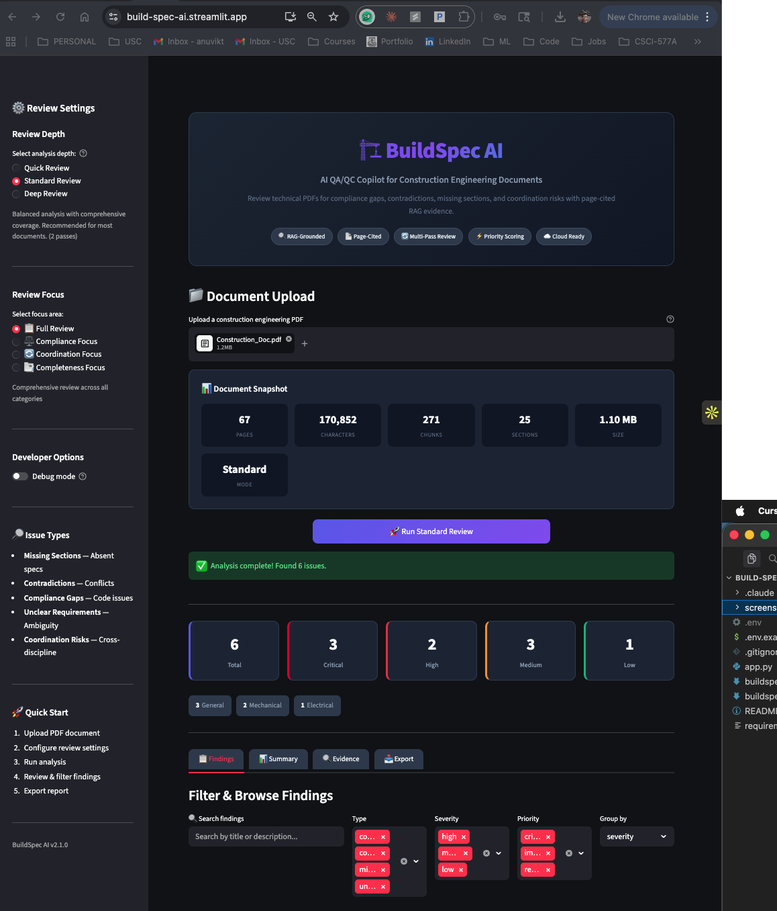
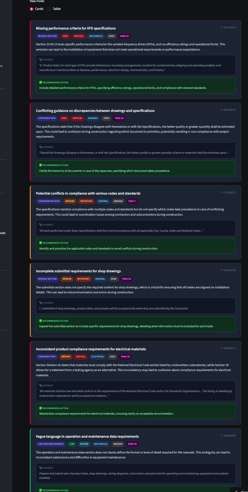

# 🏗️ BuildSpec AI

**AI QA/QC Copilot for Construction Engineering Documents**

[](https://build-spec-ai.streamlit.app)

[](https://www.python.org/downloads/)
[](https://streamlit.io)
[](https://openai.com)
[](https://opensource.org/licenses/MIT)

---

## 🎯 Try It Now

**No setup required!** Click the demo button to try BuildSpec AI instantly:

👉 **[Launch Live Demo](https://build-spec-ai.streamlit.app)** 👈

The demo includes a sample construction specification so you can see the AI in action immediately.

---

## 📸 Screenshots

<p align="center">
  
</p>

<p align="center">
  <em>Upload a construction spec → Get AI-powered QA/QC findings with page-cited evidence</em>
</p>

<p align="center">
  
</p>

<p align="center">
  <em>Each finding includes severity, discipline, evidence quote, and recommended action</em>
</p>

---

## 💡 What It Does

BuildSpec AI reviews construction engineering PDFs and identifies:

| Issue Type | What It Catches | Example |
|------------|----------------|---------|
| 🔴 **Compliance Gaps** | Missing code references, safety specs | "No arc flash labeling per NFPA 70E" |
| 🟠 **Contradictions** | Conflicting requirements | "Drawings vs specs precedence unclear" |
| 🟡 **Coordination Risks** | Cross-discipline conflicts | "MEP routing conflicts with structural" |
| 🔵 **Missing Sections** | Incomplete specifications | "No submittal requirements for VFDs" |
| ⚪ **Unclear Requirements** | Vague or ambiguous specs | "Installation method not defined" |

### Key Features

- ✅ **RAG-Grounded** — Every finding cites the exact page and quotes evidence
- ✅ **Multi-Pass Analysis** — Focused review passes catch what single prompts miss
- ✅ **Priority Scoring** — Critical issues surfaced first based on severity + type + safety
- ✅ **Demo Mode** — Try instantly with included sample document
- ✅ **Export Ready** — Download findings as JSON, CSV, Markdown, or TXT

---

## 🚀 Quick Start

### Option 1: Use the Live Demo (Recommended)

1. Go to **[build-spec-ai.streamlit.app](https://build-spec-ai.streamlit.app)**
2. Click **"Try Demo Document"** or upload your own PDF
3. Click **"Run Standard Review"**
4. Review findings and export report

### Option 2: Run Locally

```bash
# Clone the repo
git clone https://github.com/ANUVIK2401/Build-Spec-AI.git
cd Build-Spec-AI

# Create virtual environment
python -m venv venv
source venv/bin/activate  # Windows: venv\Scripts\activate

# Install dependencies
pip install -r requirements.txt

# Configure API key
cp .env.example .env
# Edit .env and add your OpenAI API key

# Run the app
streamlit run app.py
```

Open **http://localhost:8501** in your browser.

---

## 🔧 How It Works

```
┌─────────────────────────────────────────────────────────────┐
│                    BuildSpec AI Pipeline                     │
├─────────────────────────────────────────────────────────────┤
│                                                              │
│   📄 PDF Upload                                              │
│        │                                                     │
│        ▼                                                     │
│   ┌─────────────┐    ┌─────────────┐    ┌─────────────┐     │
│   │   Extract   │───▶│   Detect    │───▶│   Chunk     │     │
│   │   (PyMuPDF) │    │  Sections   │    │  (800/100)  │     │
│   └─────────────┘    └─────────────┘    └─────────────┘     │
│                                                              │
│        │                                                     │
│        ▼                                                     │
│   ┌─────────────────────────────────────────────────────┐   │
│   │              Semantic Retrieval (RAG)                │   │
│   │   • OpenAI embeddings (text-embedding-3-small)       │   │
│   │   • Multi-query retrieval for diverse evidence       │   │
│   │   • TF-IDF fallback when embeddings unavailable      │   │
│   └─────────────────────────────────────────────────────┘   │
│                                                              │
│        │                                                     │
│        ▼                                                     │
│   ┌─────────────────────────────────────────────────────┐   │
│   │              Multi-Pass Analysis                      │   │
│   │   Pass 1: Completeness → Missing sections, unclear   │   │
│   │   Pass 2: Contradictions → Conflicts, ambiguity      │   │
│   │   Pass 3: Compliance → Code gaps, coordination       │   │
│   └─────────────────────────────────────────────────────┘   │
│                                                              │
│        │                                                     │
│        ▼                                                     │
│   ┌─────────────────────────────────────────────────────┐   │
│   │           Priority Scoring & Export                   │   │
│   │   • Severity × Confidence × Type × Safety keywords   │   │
│   │   • Deduplication & quality validation               │   │
│   │   • JSON / CSV / Markdown / TXT export               │   │
│   └─────────────────────────────────────────────────────┘   │
│                                                              │
└─────────────────────────────────────────────────────────────┘
```

---

## 📋 Review Modes

| Mode | Analysis Passes | Evidence Chunks | Best For |
|------|-----------------|-----------------|----------|
| **Quick Review** | 1 pass | 8 chunks | Initial screening, time-sensitive reviews |
| **Standard Review** | 2 passes | 15 chunks | Most documents (recommended) |
| **Deep Review** | 3 passes | 25 chunks | Critical specs requiring thorough QA/QC |

### Focus Modes

- **Full Review** — Comprehensive across all issue categories
- **Compliance Focus** — Prioritize code/regulatory gaps
- **Coordination Focus** — Cross-discipline conflicts
- **Completeness Focus** — Missing sections and incomplete specs

---

## 📊 Sample Output

```json
{
  "id": "F-A3B7C912",
  "type": "compliance_gap",
  "severity": "high",
  "priority": "critical",
  "discipline": "electrical",
  "confidence": "high",
  "page": 23,
  "title": "Missing arc flash hazard analysis requirements for switchgear",
  "description": "Section 26 24 00 specifies 480V switchgear but does not require arc flash labeling or hazard analysis per NFPA 70E.",
  "evidence": "\"26 24 00 SWITCHGEAR: Provide 480V, 3-phase switchgear assembly... Labels shall indicate voltage and phase.\"",
  "recommended_action": "Add requirement for arc flash hazard analysis per NFPA 70E and IEEE 1584."
}
```

---

## 💰 Cost & Performance

| Document Size | Mode | Time | API Cost |
|---------------|------|------|----------|
| 10 pages | Quick | ~15s | ~$0.01 |
| 50 pages | Standard | ~45s | ~$0.02 |
| 100 pages | Deep | ~90s | ~$0.04 |

Uses **GPT-4o-mini** ($0.15/M input tokens) — significantly cheaper than GPT-4.

---

## 🔒 Privacy & Security

- ✅ Documents are processed in-memory only
- ✅ No data stored on servers
- ✅ API keys never logged or stored
- ✅ Streamlit Cloud secrets management

---

## 🗺️ Roadmap

- [ ] Multi-document comparison (spec vs drawings)
- [ ] PDF highlighting of issue locations
- [ ] Custom review templates
- [ ] Issue tracking integration (Jira, Asana)
- [ ] OCR support for scanned documents

---

## ⚠️ Limitations

- **Text-based PDFs only** — Scanned documents require OCR preprocessing
- **English documents** — Optimized for English specifications
- **Construction focus** — Best results with engineering/construction specs
- **AI-generated** — Findings should be verified by qualified professionals

---

## 👤 Author

**Anuvik Thota**

Building AI tools for construction engineering.

[](https://github.com/ANUVIK2401)
[](https://linkedin.com/in/anuvikthota)

---

## 📄 License

MIT License — see [LICENSE](LICENSE) for details.

---

<p align="center">
  <strong>🏗️ BuildSpec AI v2.2.0</strong><br>
  <sub>Multi-Pass RAG Analysis • Priority Scoring • Page-Cited Evidence</sub>
</p>

<p align="center">
  <a href="https://build-spec-ai.streamlit.app">
    
  </a>
</p>
